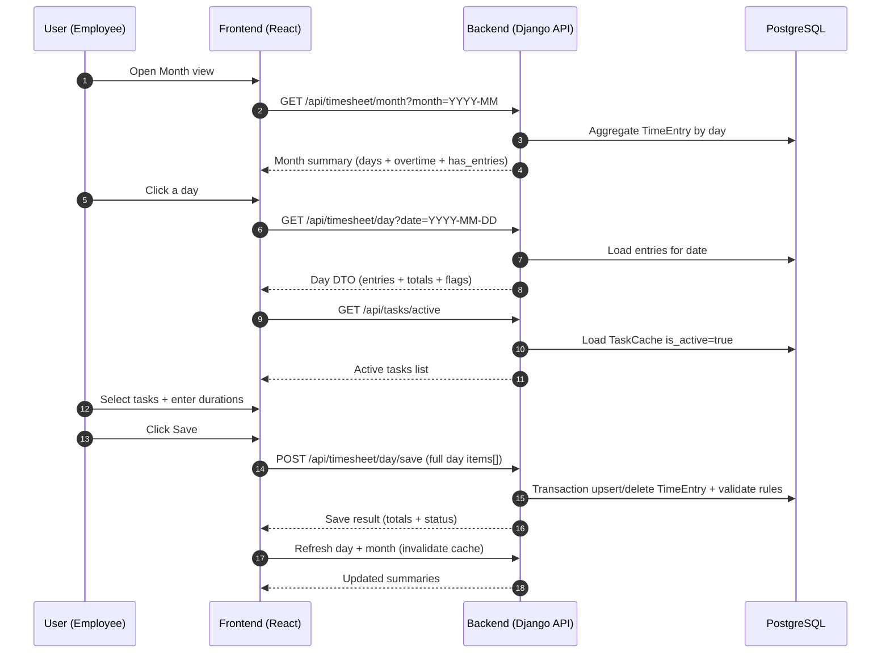

# TimeTracker

**TimeTracker** is a lightweight time logging system built as a **Django + React** application.  
Employees log time **per day** across many project tasks. Management can review totals and overtime through summarized views.

The product is intentionally focused on a simple, reliable MVP:
- **Month view** (overview, totals, overtime)
- **Day view** (fast time entry across many tasks, with filtering)

---

## 🎯 Mission (MVP)

TimeTracker exists to make daily time entry **fast and error-resistant**:

- Employees can log time against **active tasks**
- Day entry supports:
  - filtering tasks by **Project Phase / Department / Discipline**
  - free-text search (via `search_text`)
  - selection list without duplicates
  - day total limit **≤ 24h**
  - no zero-duration entries
- Month view provides:
  - day type (**Working/Free**)
  - **working time (raw)**
  - **overtime**
  - `has_entries` indicator

Authentication is admin-controlled:
- employees are **added only by admin**
- users set password via invite link and then log in with **email + password**

---

## 🧩 System overview

TimeTracker is split into two independent apps:

- **backend/** — Django API + domain rules + worker
- **frontend/** — React SPA (Month + Day screens)

The backend is the **source of truth** for:
- date editability (current month + previous month only)
- overtime calculation
- rounding for billable time (0.5h steps)
- all constraints and validation

Frontend provides UX helpers and calls the API.

---

## 🛠️ Technology stack

### Backend
- Python + Django
- PostgreSQL
- Session auth (cookies, HttpOnly)
- Outbox pattern + worker process (DB-backed async jobs)

### Frontend
- Vite
- React + TypeScript
- SPA routing
- API calls with cookie sessions (`credentials: "include"`)

### Deployment
- Docker + Docker Compose
- Optional Nginx reverse proxy (production compose)

---

## 🏗️ Architecture

### Layered backend (Django)

```mermaid
graph TD
  UI[Frontend SPA] -->|HTTP JSON + cookies| API[Django API Views]
  API --> SVC[Service Layer]
  SVC --> DM[Domain Models]
  SVC --> OB[Outbox Enqueue]
  OB --> DB[(PostgreSQL)]
  DM --> DB

  WRK[Worker] --> OB2[Outbox Dispatcher]
  OB2 --> DB
  OB2 --> HND[Handlers]
````

**Responsibilities**

* API Views: HTTP adaptation only (thin controllers)
* Services: domain logic (`save_day`, `month_summary`, auth flows)
* Models: persistence, indexes, constraints
* Outbox: durable background job queue
* Worker: executes outbox jobs (idempotent, retryable)

---

## 📊 Core data model (MVP)

```mermaid
erDiagram
  EMPLOYEE ||--o{ TIME_ENTRY : logs
  TASK_CACHE ||--o{ TIME_ENTRY : receives
  CALENDAR_OVERRIDE ||--o{ DAY : defines

  EMPLOYEE {
    int id PK
    string email UNIQUE
    bool is_active
    int daily_norm_minutes
  }

  TASK_CACHE {
    int id PK
    bool is_active
    string display_name
    string search_text
    string account
    string project
    string phase
    string project_phase
    string department
    string discipline
    string task_type
    json fields_json
  }

  TIME_ENTRY {
    int id PK
    int employee_id FK
    int task_id FK
    date work_date
    int duration_minutes_raw
    int billable_half_hours
  }

  CALENDAR_OVERRIDE {
    int id PK
    date day UNIQUE
    string day_type  "Working|Free"
  }
```

### Key constraints (MVP)

* No duplicates per user/day/task:

  * `UNIQUE(employee_id, work_date, task_id)`
* No future entries
* Editing allowed only for **current month + previous month**
* Day total raw duration `<= 1440 minutes`
* Duration must be `> 0`
* Billable rounding:

  * `billable_half_hours = ceil(duration_minutes_raw / 30)`

---

## 🧭 UI flow (Month → Day → Save)



---

## 🚀 Quick start (development)

### Prerequisites

* Docker Desktop (recommended)
* Node.js + npm (for frontend local dev)
* Python (optional if not using Docker)

---

## Option A: Docker (recommended)

**Szczegółowe instrukcje Docker:** Zobacz [`DOCKER.md`](DOCKER.md) dla pełnej dokumentacji środowisk dev i prod.

**Szybki start:**

1. Skopiuj `.env.example` do `.env`:

```bash
cp .env.example .env
```

2. Uruchom dev stack:

```bash
docker compose -f docker-compose.dev.yml up --build
```

3. Wykonaj migracje i utwórz superusera (w osobnym terminalu):

```bash
docker exec -it timetracker_backend_dev python manage.py migrate
docker exec -it timetracker_backend_dev python manage.py createsuperuser
```

4. Dostęp:

* **Frontend:** http://localhost:5173
* **Backend API:** http://localhost:8000/api
* **Django Admin:** http://localhost:8000/admin

---

## Option B: Local development

### Backend (Django)

```bash
# from repo root
python -m venv .venv
# activate venv (Windows PowerShell)
.\.venv\Scripts\Activate.ps1

pip install -r backend/requirements.txt
python backend/manage.py migrate
python backend/manage.py createsuperuser
python backend/manage.py runserver
```

### Frontend (React)

```bash
cd frontend
npm install
npm run dev
```

---

## 📁 Repository structure

```text
timetracker/
├── AGENTS.md
├── README.md
├── backend/
│   ├── AGENTS.md
│   ├── README.md
│   └── timetracker_app/
│       ├── services/
│       ├── auth/
│       ├── outbox/
│       └── api/
└── frontend/
    ├── AGENTS.md
    ├── README.md
    └── src/
        └── pages/
            └── Day/
                └── AGENTS.md
```

---

## 🔐 Authentication (admin-only provisioning)

* Admin creates an employee in admin panel
* System generates an **invite token** and sends (or shows) a link
* User sets password once via `/set-password?token=...`
* User logs in with **email + password**
* Password reset uses one-time reset tokens

No public registration exists in MVP.

---

## ✅ Development guidelines (short)

* Read `AGENTS.md` files before making changes
* Backend rules live in `services/`
* Keep controllers thin
* Add constraints + indexes in DB, not only in code
* Write tests for:

  * `save_day()` validation and upsert/delete behavior
  * invite/reset token flows
  * duplicate prevention and date rules

---

## 📄 License

See `LICENSE`.
